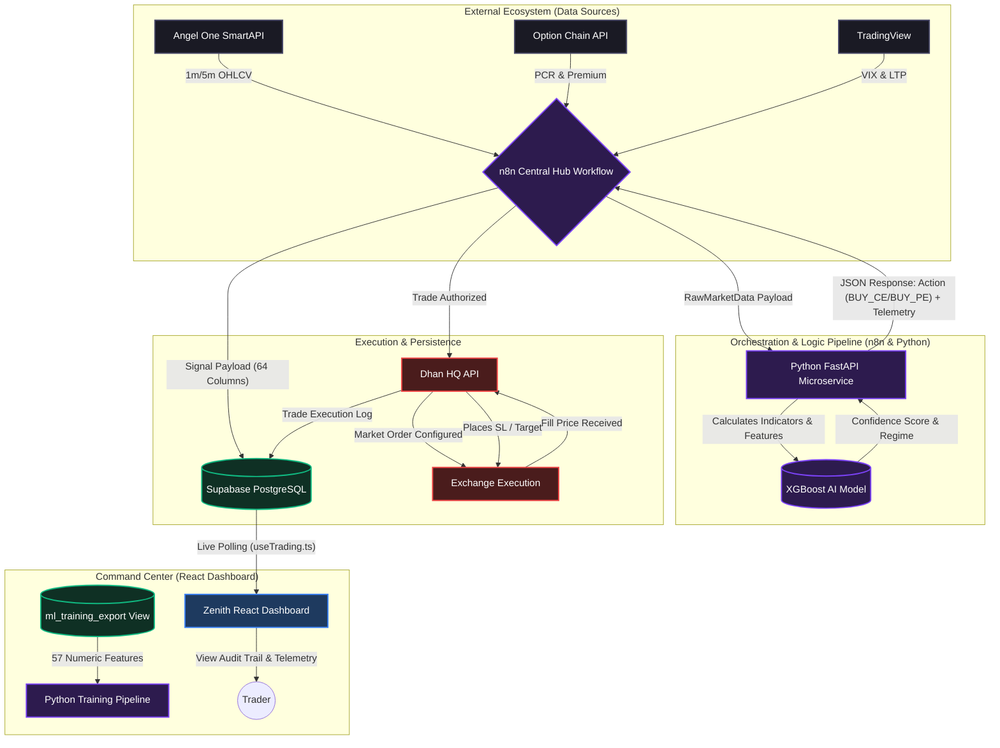
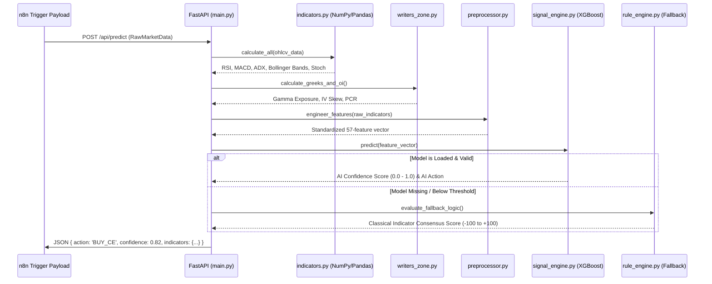
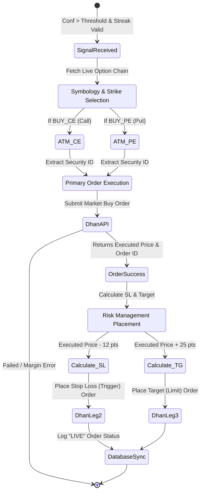
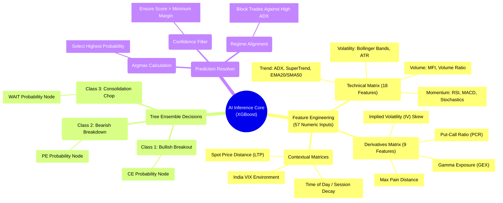

# Zenith Quantum Terminal v4.2.0 - Complete System Architecture & Operational Guidelines

This document provides high-fidelity, comprehensive technical diagrams and deep-dive explanations of the Zenith trading system. It is designed to expose the intricate mechanisms driving data ingestion, AI inference, order execution, and continuous model improvement.

---

## 1. Complete Project Architecture Diagram
This diagram illustrates the entirety of the Proximus-1 / Zenith ecosystem, highlighting the transition from raw market data ingestion to trade execution and telemetry visualization.

### Working Principle:
1. **Acquisition**: n8n serves as the rhythmic heartbeat, waking up every 5 minutes to gather live OHLCV, Option Chain (PCR), and VIX data.
2. **Analysis**: n8n forwards this raw data matrix to the Python FastAPI microservice. The Python engine calculates complex technicals (Gamma Exposure, SMC, VAH/VAL) and passes them to an XGBoost model.
3. **Decoupled Execution**: The Python API responds with a trading directive. If risk constraints are passed, n8n executes the trade concurrently via Dhan APIs and saves the 64-column telemetry feature matrix directly into Supabase.
4. **Monitoring**: The React dashboard uses a centralized polling hook to monitor Supabase updates, visualizing the live signals and database health.

---

## 2. Python AI Model Processing Diagram
A deep breakdown of the `api/main.py` inference lifecycle when predicting on new market data.

### Working Principle:
The Python microservice avoids simple indicator crossovers. Instead, it utilizes high-dimensional feature engineering:
- Native `pandas`/`numpy` arrays calculate 18 technical indicators and 9 derivatives-specific metrics.
- The `preprocessor.py` scales these values into a fixed-width vector precisely matching the ML training format.
- The XGBoost engine produces a probabilistic confidence score. If the AI model has low certainty (or isn't compiled), it falls back to a deterministic **25-step Logic Rule Engine**.

---

## 3. Data Collection & Feature Store Diagram
This maps how raw exchange ticks become curated ML features in the Supabase database.

```mermaid
graph LR
    classDef source fill:#1a1a24,stroke:#4a4a6a
    classDef pipeline fill:#2d1b4e,stroke:#7b42f6
    classDef storage fill:#0f3024,stroke:#10b981

    T1["Angel One"]:::source --> |"1m & 5m Candles"| Ingest["n8n Workflow"]:::pipeline
    T2["TradingView"]:::source --> |"VIX Fetch"| Ingest
    
    Ingest --> |"Composite JSON"| PythonAPI["Python Feature Extraction"]:::pipeline
    PythonAPI --> |"Calculated Metrics"| N8NMapper["n8n Database Mapper"]:::pipeline
    
    N8NMapper --> |"UPSERT"| Supabase[("Supabase 'signals' Table")]:::storage
    
    subgraph "Supabase Schema (64 Columns)"
        Meta["Metadata: Session, Time, Latency"]
        Context["Market Context: LTP, VIX"]
        Tech["Technicals: RSI, MACD, ADX, Momentum"]
        Deriv["Derivatives: PCR, GEX, IV Skew"]
        State["Engine Output: AI Score, Action, Reasons"]
    end
    
    Supabase -.-> Meta
    Supabase -.-> Context
    Supabase -.-> Tech
    Supabase -.-> Deriv
    Supabase -.-> State
```

### Working Principle:
Data collection is strict and immutable. Every 5 minutes, an exact snapshot of the market is taken. The Python engine calculates indicators based on the snapshot. n8n physically maps this complex structure into a flat 64-column PostgreSQL table (`signals`) on Supabase. This creates a highly balanced historical dataset capturing every volatile jump and every sideways chop.

---

## 4. Order Execution Diagram
When a valid signal is approved, this is the precise execution pathway via Dhan HQ.

### Working Principle:
1. **Dynamic Generation**: The system never hard-codes symbols. It pulls the specific At-The-Money (ATM) option for the current NIFTY spot price to ensure optimal delta.
2. **Atomic Routing**: It instantly fires a Market Order to Dhan. 
3. **Imperative Protection**: Crucially, it waits for the *exact filled price* from the exchange (to account for slippage) before calculating the static Stop Loss (-12 pts) and Target (+25 pts). It then places both legs simultaneously.

---

## 5. Exit Order Monitoring Diagram
Located in `exit_order_monitor.json` across n8n.

```mermaid
graph TD
    classDef monitor fill:#4a1c1c,stroke:#ef4444,stroke-width:2px;
    classDef logic fill:#1e3a5f,stroke:#3b82f6;

    Trigger["Cron: Every 1 Minute"]:::monitor --> FetchLive["Fetch Open Positions from Dhan"]:::logic
    FetchLive --> HasPositions{"Open POS > 0?"}
    
    HasPositions -- "YES" --> FetchDB["Fetch 'LIVE' Records from Supabase"]:::logic
    HasPositions -- "NO" --> End[*]
    
    FetchDB --> Compare{"Match Positions?"}
    Compare -- "Match Found" --> Eval["Evaluate P&L"]:::logic
    
    Eval --> CheckSL{"Hit Stop Loss?"}
    CheckSL -- "YES" --> ExitOrder["Place Market Sell"]:::monitor
    
    CheckSL -- "NO" --> CheckTarget{"Hit Target?"}
    CheckTarget -- "YES" --> ExitOrder
    
    CheckTarget -- "NO" --> CheckTrailing{"P&L > Trailing Threshold?"}
    CheckTrailing -- "YES" --> ModifySL["Modify SL Trigger Price in Dhan"]:::monitor
    CheckTrailing -- "NO" --> End
    
    ExitOrder --> UpdateDB["Update Supabase: Status = 'CLOSED'"]:::logic
    ModifySL --> End
    UpdateDB --> End
```

### Working Principle:
A dedicated sub-workflow independent of the primary entry logic. It checks Dhan's open positions every minute. If an option reaches a predefined profit threshold, it interacts with Dhan's modification API to move the Stop Loss up ("Trailing SL"), protecting capital dynamically. If SL or Target boundaries are breached by rapid ticks that the broker didn't catch, the monitor forces a Market Exit and updates the Supabase record to `CLOSED`.

---

## 6. AI Model Training Diagram
How the system gets smarter over time.

```mermaid
graph TD
    classDef sql fill:#0f3024,stroke:#10b981,stroke-width:2px;
    classDef python fill:#2d1b4e,stroke:#7b42f6,stroke-width:2px;
    
    RawDB[("Supabase 'signals' Table")]:::sql --> SQLView["SQL View: 'ml_training_export'"]:::sql
    
    SQLView -- "Automated Formatting" --> Matrix["57-Column Numeric Feature Matrix"]:::sql
    Matrix -- "Includes Labels (Win/Loss)" --> TrainingScript["train_model.py"]:::python
    
    TrainingScript --> Cleanse["Pandas: Handle NaNs & Inf"]:::python
    Cleanse --> Stratify["Train/Test Split (80/20)"]:::python
    
    Stratify --> XGBoost["XGBoost DMatrix Compilation"]:::python
    XGBoost --> HyperTuning["GridSearchCV / Tuning"]:::python
    
    HyperTuning --> Evaluate{"Validation Accuracy >= 65%?"}
    
    Evaluate -- "NO" --> Reject["Discard Model"]:::python
    Evaluate -- "YES" --> Export["Export model.pkl & Feature Importances"]:::python
    Export --> Deploy["Update API /engine/models/"]:::python
```

### Working Principle:
1. **The SQL Transformation Pipeline**: To prevent Jupyter notebook spaghetti, Supabase possesses a dedicated View (`ml_training_export`) that strips strings and correctly encodes timestamps and categories on the database level.
2. **Stratified Extraction**: `train_model.py` directly pulls this mathematically pure matrix.
3. **Training & Validation**: It utilizes `xgboost`, applying a rigorous Train/Test split. Crucially, the dataset includes balanced "WAIT" states, ensuring the model learns *when not to trade* just as aggressively as when to trade.
4. **Export**: Upon successful validation, it serializes a new `.pkl` binary model, replacing the older model dynamically without causing downtime on the API container.

---

## 7. AI Model Deep-Dive: Features & Decision Logic
This diagram visualizes the internal architecture of the XGBoost predict function, outlining how the 57 features are broken down to formulate the final market projection.

### The 57-Feature Anatomy & Processing Rules:
The AI Model abandons rudimentary "if/then" cross-overs. Instead, it processes the environment holistically using its internal Decision Trees (`XGBoost Classifier`):

1. **The Technical Matrix**: The model learns that high RSI (`>70`) in a high ADX (`>30`) environment is a breakout (continue buying), but high RSI in a low ADX (`<15`) environment is overbought (prime for a reversal).
2. **The Derivatives Matrix**: The engine places heavy weight on institutional positioning. If the `Put-Call Ratio (PCR)` is `< 0.7` and `Gamma Exposure` leans heavily negative, the AI severely penalizes "Call" signals, learning to ride the trend of the Options Writers.
3. **The 'WAIT' Training Class**: Unlike models that only guess Up or Down, Zenith features a robust 3-class system. It is heavily trained on "Sideways" and "Whipsaw" data samples, granting it the power to proactively return a `WAIT` state, preserving capital during algorithmic chop.
4. **Ensemble Voting**: Deep within the Python predict script, `XGBoost` generates a probability spread (e.g., `[Buy CE: 78%, Buy PE: 04%, WAIT: 18%]`). The `Argmax Calculator` selects the winning vector. If the winning vote doesn't exceed the Confidence Threshold configured in `engine.py`, the action is safely neutralized.
