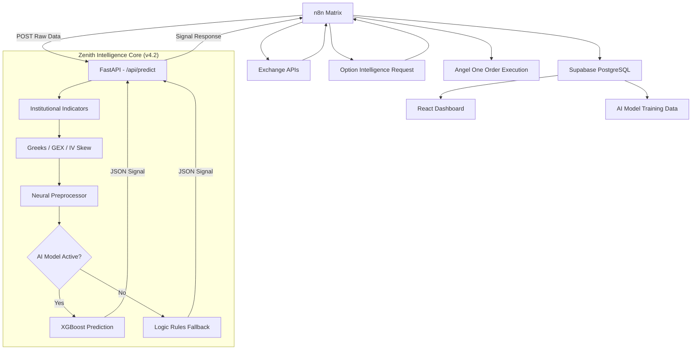

# 🔄 Supabase Migration Guide — Google Sheets to PostgreSQL

> **Version:** 1.0.0
> **Date:** 20 March 2026
> **Status:** Migration Complete — Awaiting Deployment
> **Replaces:** Google Sheets v4.2 Persistent Ledger

---

## Table of Contents

1. [Migration Overview](#1-migration-overview)
2. [Architecture Change](#2-architecture-change)
3. [Why Supabase](#3-why-supabase)
4. [Database Schema](#4-database-schema)
5. [Workflow Changes](#5-workflow-changes)
6. [Code Node Changes](#6-code-node-changes)
7. [Setup Instructions](#7-setup-instructions)
8. [Data Migration](#8-data-migration)
9. [SQL Views for Analytics](#9-sql-views-for-analytics)
10. [Impact on AI Model Training](#10-impact-on-ai-model-training)
11. [File Reference](#11-file-reference)

---

## 1. Migration Overview

The trading bot's data persistence layer has been migrated from **Google Sheets API** to **Supabase (PostgreSQL)**. This affects **6 nodes** across **2 n8n workflows**.

| Metric | Before | After |
|--------|--------|-------|
| **Database** | Google Sheets v4 API | Supabase PostgreSQL |
| **Read Latency** | 500ms–3s | 5–50ms |
| **Write Latency** | 1–3s | 10–100ms |
| **Rate Limits** | 60 req/min | 500+ req/s |
| **Querying** | Full table scan | Indexed SQL queries |
| **Data Types** | All strings | Proper NUMERIC, TIMESTAMPTZ |
| **ML Training Data** | Manual CSV export | Direct SQL/REST queries |

---

## 2. Architecture Change

### Before (Google Sheets)

```
n8n Workflow → Google Sheets API (appendOrUpdate) → Sheets Doc
                                                      ↓
                                               React Dashboard (CSV export poll)
```

### After (Supabase)

```
n8n Workflow → Supabase Node (create/update/getAll) → PostgreSQL
                                                        ↓
                                               React Dashboard (REST API)
                                               Python AI Engine (direct SQL)
```

### Updated Architecture Diagram



---

## 3. Why Supabase

### Critical Performance Issues with Google Sheets

1. **Exit Monitor Bottleneck** — The `exit_order_monitor` runs every 2 minutes. With Google Sheets, it performed a **full table scan** (read ALL rows) to find ACTIVE orders, taking 3–5 seconds per cycle
2. **Rate Limiting** — Google Sheets API allows only 60 requests/minute. During active trading with both workflows running, this limit was frequently approached
3. **No Indexing** — Google Sheets has no concept of database indexes. Finding an order by `Entry Order ID` required scanning every row
4. **String-Only Storage** — All data stored as strings, requiring type conversion for any calculation
5. **Concurrency Issues** — Google Sheets locks during writes, causing queue delays when both workflows write simultaneously

### Supabase Advantages

- **Indexed Queries** — `WHERE status = 'ACTIVE'` uses an index, returning results in <20ms
- **Proper Data Types** — Numbers stay as numbers, timestamps as timestamps
- **Concurrent Access** — Multiple workflows can read/write simultaneously
- **Built-in REST API** — PostgREST auto-generates endpoints for all tables
- **Row Level Security** — Fine-grained access control
- **Free Tier** — 500MB database, unlimited API requests
- **n8n Native Support** — First-class Supabase node in n8n

---

## 4. Database Schema

Three tables replace the three Google Sheet tabs:

### Table: `signals` (replaces "Signals" tab)

| Column | Type | Description |
|--------|------|-------------|
| `id` | UUID (PK) | Auto-generated unique ID |
| `timestamp` | TIMESTAMPTZ | Signal generation time |
| `signal` | TEXT | BUY_CE / BUY_PE / HOLD |
| `confidence` | NUMERIC(5,4) | AI confidence score (0–1) |
| `rsi` | NUMERIC(8,2) | RSI value at signal time |
| `macd` | NUMERIC(10,4) | MACD histogram value |
| `momentum` | NUMERIC(8,2) | Price momentum |
| `volume_ratio` | NUMERIC(8,2) | Current/average volume ratio |
| `vix` | NUMERIC(8,2) | India VIX |
| `sentiment` | TEXT | Market sentiment classification |
| `writers_zone` | TEXT | BULLISH / NEUTRAL / BEARISH |
| `candle_pattern` | TEXT | Detected candlestick pattern |
| `spot_price` | NUMERIC(10,2) | BANKNIFTY spot price |
| `market_strength` | NUMERIC(8,2) | Composite market strength score |
| `put_call_ratio` | NUMERIC(8,4) | Put-Call OI ratio |
| `writers_confidence` | NUMERIC(5,4) | Writers zone confidence (0–1) |
| `created_at` | TIMESTAMPTZ | Row creation timestamp |

### Table: `active_exit_orders` (replaces "Active_Exit_Orders" tab)

| Column | Type | Description |
|--------|------|-------------|
| `id` | UUID (PK) | Auto-generated unique ID |
| `entry_order_id` | TEXT (UNIQUE) | Angel One entry order ID |
| `sl_order_id` | TEXT | Stop-loss order ID |
| `target_order_id` | TEXT | Target order ID |
| `symbol` | TEXT | Trading symbol (e.g., BANKNIFTY26MAR53000CE) |
| `entry_price` | NUMERIC(10,2) | Entry fill price |
| `sl_price` | NUMERIC(10,2) | Stop-loss trigger price |
| `target_price` | NUMERIC(10,2) | Target limit price |
| `quantity` | INTEGER | Number of lots |
| `timestamp` | TIMESTAMPTZ | Order placement time |
| `status` | TEXT | ACTIVE / COMPLETED |
| `risk_reward_ratio` | NUMERIC(6,2) | Planned risk-reward ratio |
| `exit_type` | TEXT | STOP_LOSS / TARGET (set on completion) |
| `exit_price` | NUMERIC(10,2) | Actual exit price |
| `pnl` | NUMERIC(12,2) | Realized P&L |
| `exit_timestamp` | TIMESTAMPTZ | Exit execution time |

### Table: `trades` (replaces "Trades" tab)

| Column | Type | Description |
|--------|------|-------------|
| `id` | UUID (PK) | Auto-generated unique ID |
| `entry_order_id` | TEXT (UNIQUE) | Angel One entry order ID |
| `timestamp` | TIMESTAMPTZ | Trade entry time |
| `symbol` | TEXT | Trading symbol |
| `entry_price` | NUMERIC(10,2) | Entry fill price |
| `stop_loss` | NUMERIC(10,2) | SL price |
| `target` | NUMERIC(10,2) | Target price |
| `quantity` | INTEGER | Lot size |
| `status` | TEXT | ACTIVE / CLOSED |
| `signal` | TEXT | BUY_CE / BUY_PE |
| `confidence` | NUMERIC(5,4) | Signal confidence |
| `risk_reward_ratio` | NUMERIC(6,2) | Planned R:R |
| `exit_price` | NUMERIC(10,2) | Actual exit price |
| `pnl` | NUMERIC(12,2) | Realized P&L |
| `exit_type` | TEXT | STOP_LOSS / TARGET |
| `exit_timestamp` | TIMESTAMPTZ | Exit time |

### Indexes

```sql
-- Fast lookups for Exit Monitor (runs every 2 minutes)
CREATE INDEX idx_exit_orders_status ON active_exit_orders(status);
CREATE INDEX idx_exit_orders_entry_id ON active_exit_orders(entry_order_id);

-- Fast trade lookups
CREATE INDEX idx_trades_status ON trades(status);
CREATE INDEX idx_trades_entry_id ON trades(entry_order_id);

-- ML training data queries
CREATE INDEX idx_signals_timestamp ON signals(timestamp DESC);
CREATE INDEX idx_signals_signal ON signals(signal);
CREATE INDEX idx_trades_timestamp ON trades(timestamp DESC);
```

---

## 5. Workflow Changes

### Workflow 1: Main Trading Bot

**File:** `NEWN8NFINAL_SUPABASE.JSON` (replaces `NEWN8NFINAL.JSON`)

| Node # | Old Node | New Node | n8n Type | Operation |
|--------|----------|----------|----------|-----------|
| 13 | `Log Signal to Sheets` | `Log Signal to Supabase` | `n8n-nodes-base.supabase` | `create` → `signals` |
| 19 | `Log Exit Orders to Sheets` | `Log Exit Orders to Supabase` | `n8n-nodes-base.supabase` | `create` → `active_exit_orders` |
| 20 | `Log Trade Summary` | `Log Trade Summary to Supabase` | `n8n-nodes-base.supabase` | `create` → `trades` |

All other nodes (Cron, API calls, Code nodes, IF filters, Order placement) remain **unchanged**.

### Workflow 2: Exit Order Monitor

**File:** `exit_order_monitor_supabase.json` (replaces `exit_order_monitor.json`)

| Node # | Old Node | New Node | Operation | Key Improvement |
|--------|----------|----------|-----------|----------------|
| 4 | `Get Active Exit Orders` (Google Sheets read ALL) | `Get Active Exit Orders` (Supabase getAll) | `getAll` with filter `status = 'ACTIVE'` | **Indexed query — 60x faster** |
| 9 | `Update Exit Order Status` (Google Sheets update) | `Update Exit Order Status` (Supabase update) | `update` where `entry_order_id = X` | Direct key lookup |
| 10 | `Update Trade Status` (Google Sheets update) | `Update Trade Status` (Supabase update) | `update` where `entry_order_id = X` | Direct key lookup |

---

## 6. Code Node Changes

The `Analyze Exit Executions` Code node in the Exit Monitor was updated to use **snake_case** column names (PostgreSQL convention) instead of Title Case with spaces (Google Sheets convention):

```diff
  // Column reference changes:
- exitOrderRow['SL Order ID']       
+ exitOrderRow.sl_order_id

- exitOrderRow['Target Order ID']   
+ exitOrderRow.target_order_id

- exitOrderRow['Entry Order ID']    
+ exitOrderRow.entry_order_id

- exitOrderRow['Entry Price']       
+ exitOrderRow.entry_price

- exitOrderRow['Quantity']          
+ exitOrderRow.quantity

- exitOrderRow.Status               
+ exitOrderRow.status
```

---

## 7. Setup Instructions

### Step 1: Create Supabase Project

1. Go to [supabase.com](https://supabase.com) → **New Project**
2. Name: `zenith-trading-bot`
3. Set a strong database password
4. Region: Mumbai (ap-south-1) or Singapore

### Step 2: Run Schema SQL

1. Supabase Dashboard → **SQL Editor** → **New Query**
2. Copy entire contents of `n8n/supabase_schema.sql`
3. Click **Run**
4. Verify: 3 tables appear in **Table Editor**

### Step 3: Configure n8n Credential

1. n8n → **Credentials** → **New** → **Supabase API**
2. **Host**: `https://xxxxx.supabase.co` (from Settings → API → Project URL)
3. **Service Role Key**: Copy from Settings → API → `service_role` key

### Step 4: Import Workflows

1. Import `NEWN8NFINAL_SUPABASE.JSON` into n8n
2. Import `exit_order_monitor_supabase.json` into n8n
3. Select the Supabase credential in all 6 Supabase nodes

### Step 5: Deactivate Old Workflows

1. Deactivate `NEWN8NFINAL.JSON` (Google Sheets version)
2. Deactivate `exit_order_monitor.json` (Google Sheets version)

---

## 8. Data Migration

### Importing Historical Google Sheets Data

1. Open Google Sheet → Select tab (Signals / Active_Exit_Orders / Trades)
2. **File → Download → Comma-separated values (.csv)**
3. Rename CSV headers from Title Case to snake_case:

| Google Sheets Header | Supabase Column |
|---------------------|-----------------|
| Timestamp | timestamp |
| Signal | signal |
| Confidence | confidence |
| RSI | rsi |
| MACD | macd |
| Momentum | momentum |
| Volume Ratio | volume_ratio |
| VIX | vix |
| Sentiment | sentiment |
| Writers Zone | writers_zone |
| Candle Pattern | candle_pattern |
| Spot Price | spot_price |
| Market Strength | market_strength |
| Put Call Ratio | put_call_ratio |
| Writers Confidence | writers_confidence |
| Entry Order ID | entry_order_id |
| SL Order ID | sl_order_id |
| Target Order ID | target_order_id |
| Entry Price | entry_price |
| SL Price | sl_price |
| Target Price | target_price |
| Risk Reward Ratio | risk_reward_ratio |

4. In Supabase → **Table Editor** → Select table → **Insert** → **Import from CSV**
5. Upload the renamed CSV file
6. Verify row counts match

---

## 9. SQL Views for Analytics

The schema includes pre-built views for trading analytics:

### `completed_trades_summary`

```sql
SELECT * FROM completed_trades_summary;
-- Returns: entry_order_id, symbol, signal, entry_price, exit_price, 
--          pnl, exit_type, confidence, risk_reward_ratio, 
--          entry_time, exit_time, duration_minutes
```

### `daily_pnl_summary`

```sql
SELECT * FROM daily_pnl_summary;
-- Returns: trade_date, total_trades, winning_trades, losing_trades,
--          total_pnl, avg_pnl, best_trade, worst_trade
```

### `signal_accuracy`

```sql
SELECT * FROM signal_accuracy;
-- Returns: signal, total_signals, avg_confidence, avg_rsi, 
--          avg_vix, avg_market_strength
```

---

## 10. Impact on AI Model Training

### Before (Google Sheets)

```python
# Manual process:
# 1. Export CSV from Google Sheets
# 2. Load into pandas
# 3. Clean data types (everything is strings)
# 4. Train model
```

### After (Supabase)

```python
import requests

SUPABASE_URL = "https://xxxxx.supabase.co"
SUPABASE_KEY = "your-service-role-key"

# Direct API call — properly typed data
response = requests.get(
    f"{SUPABASE_URL}/rest/v1/signals?select=*&order=timestamp.desc",
    headers={
        "apikey": SUPABASE_KEY,
        "Authorization": f"Bearer {SUPABASE_KEY}"
    }
)
training_data = response.json()  # List of dicts, proper types
```

Or add a dedicated training data endpoint to the FastAPI app that queries Supabase directly.

---

## 11. Phase 2: High-Fidelity Signal Mapping (Updated 20 March)

Initial deployment logged only 15 indicators. The system was updated to support the full **57-feature decision package** returned by the Zenith Python Engine.

### Key Additions:
- **Regime Detection**: Logging of `HIGH_VOLATILITY`, `SIDEWAYS`, and `TRENDING` classifications.
- **Institutional Greeks**: Gamma Exposure (GEX) and IV Skew mappings.
- **Trend Metrics**: ADX, SuperTrend, and Price Action Scores.
- **AI Insights**: The `reason` and `ai_insights` fields now store the full logic trace for every trade.

---

## 12. React Frontend Switch

The Web Dashboard was updated to consume Supabase directly, eliminating the need for periodic CSV polling from Google Sheets.

### Key Changes:
- **API Layer**: Replaced `sheetsApi.ts` with `supabaseApi.ts`.
- **Environment**: Added `VITE_SUPABASE_URL` and `VITE_SUPABASE_ANON_KEY` to `.env`.
- **Client**: Initialized `@supabase/supabase-js` client in `src/services/supabaseClient.ts`.
- **Real-time Hook**: `useTrading.ts` now uses Supabase queries with auto-refresh on trade updates.

---

## 13. File Reference (Updated)

| File | Location | Purpose |
|------|----------|---------|
| `supabase_schema.sql` | `n8n/supabase_schema.sql` | **V2 Schema**: Includes all 57 features + analytics views. |
| `NEWN8NFINAL_SUPABASE.JSON` | `n8n/workflows/` | Main bot with high-fidelity Supabase logging. |
| `supabaseApi.ts` | `src/services/` | Frontend data interface for Supabase. |
| `supabaseClient.ts` | `src/services/` | Supabase client initialization. |
| `transform_signals.py` | `project/` | Historical CSV → Supabase transformation utility. |

---

*Migration Document v1.1.0 | Zenith Professional Standard | 20 March 2026*
