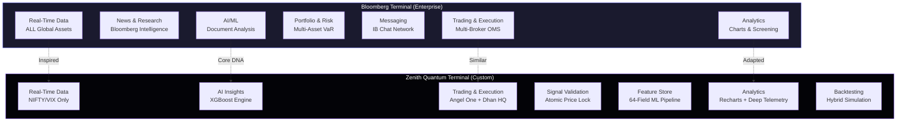

# 💠 Bloomberg Terminal vs Zenith Quantum Terminal
## Deep-Dive Comparative Analysis & Strategic Roadmap

> **Date:** 2026-04-03  
> **Context:** Understanding how Bloomberg Terminal relates to the Zenith project, key differences, adaptable features, and strategic recommendations.

---

## 1. What is Bloomberg Terminal?

The Bloomberg Terminal is the **gold standard** of financial information platforms, used by over **350,000 professionals** worldwide. It costs approximately **$24,000–$27,000 per user per year** and provides a unified ecosystem for:

| Capability | Description |
|---|---|
| **Real-Time Data** | Sub-second latency feeds across ALL global asset classes (equities, bonds, FX, commodities, derivatives) |
| **News & Intelligence** | Proprietary Bloomberg News + aggregated third-party research |
| **Messaging (IB Chat)** | Secure, compliant instant messaging network connecting finance professionals globally |
| **Trading & Execution** | Integrated OMS/EMS for electronic trading across multiple brokers |
| **Portfolio & Risk** | Multi-asset risk models, VaR/CVaR, stress testing, scenario analysis |
| **Data APIs** | BLPAPI and Excel add-ins for pulling data into custom models |
| **AI Document Analysis** | (2025+) AI-powered synthesis of earnings transcripts and research reports |
| **Command-Line Interface** | Signature keyboard with mnemonics (`WEI`, `GP`, `ALLQ`) for rapid navigation |

### Bloomberg's Moat
1. **Network Effects** — 350K+ users means everyone *has* to be on it
2. **Data Breadth** — Decades of aggregated proprietary + third-party data
3. **Reliability** — Mission-critical, sub-second latency, 99.99% uptime
4. **Compliance** — All communications archived for regulatory compliance

---

## 2. What is Zenith Quantum Terminal?

Zenith is a **custom-built, AI-powered trading terminal** focused exclusively on **Indian Derivatives (NIFTY/BankNifty options)**. It represents a vertically integrated system with:

| Component | Technology | Role |
|---|---|---|
| **Intelligence Hub** | Python (FastAPI + XGBoost) | Signal generation, feature engineering, AI inference |
| **Operational Matrix** | n8n Orchestrator | Pipeline management, 5-min polling, broker connectivity |
| **Terminal Interface** | React + TypeScript + Vite | Real-time monitoring dashboard with glassmorphic UI |
| **Persistent Ledger** | Supabase (PostgreSQL) | 64-field ML Feature Store, trade history, signals |
| **Market Data** | TradingView Scanner API | Real-time NIFTY/VIX spot prices |
| **Broker Integration** | Angel One + Dhan HQ (via n8n) | Order execution and trade lifecycle |

### Zenith's Core Pages
```
DashboardPage     → KPIs, equity curve, signal direction, deep telemetry matrix
SignalsPage        → Full signal history with 64-field detail per signal
ValidationPage     → Atomic price locking for signal audit integrity
BacktestPage       → Hybrid backtesting (broker-match + probabilistic fill)
AnalyticsPage      → Performance analytics (equity curve, daily P&L, VIX buckets)
TradesPage         → Active and historical trade management
PythonEnginePage   → AI engine health and diagnostics
StrategyTuningPage → Configuration and threshold management
XAIPage            → Explainable AI insights
SettingsPage       → System preferences
HistoryPage        → Historical signal archive
```

---

## 3. How Bloomberg Relates to Zenith



### The Core Relationship
Zenith is essentially a **hyper-specialized, AI-first version** of what Bloomberg does for institutional desks — but built for a single use case: **NIFTY options trading with automated intelligence**.

| Concept | Bloomberg | Zenith |
|---|---|---|
| **Philosophy** | Be the *everything terminal* for finance | Be the *perfect terminal* for one strategy |
| **Scope** | Horizontal (all assets, all markets) | Vertical (NIFTY derivatives only) |
| **Intelligence** | Human-driven analysis with data tools | AI-driven signal generation with human oversight |
| **Cost** | $24,000/year per seat | Near-zero (self-hosted, open-source stack) |
| **Users** | 350,000+ professionals | Single operator (you) |

---

## 4. Key Differences — Feature-by-Feature Breakdown

### 4.1 Data Architecture

| Dimension | Bloomberg | Zenith | Gap Analysis |
|---|---|---|---|
| **Asset Coverage** | Global multi-asset (equities, bonds, FX, commodities, derivs) | NIFTY + BankNifty options only | ⚠️ By design — Zenith is specialized |
| **Data Sources** | Direct exchange feeds, proprietary aggregation | TradingView Scanner + broker APIs | 🔴 Single point of failure |
| **Historical Depth** | Decades of tick-level data across all markets | ~30 days of 5-min signal snapshots | 🔴 Critical gap for ML training |
| **Latency** | Sub-second (hard-wired exchange connections) | 5-minute polling intervals | 🟡 Acceptable for options but not HFT |
| **Data Reliability** | 99.99% uptime, redundant feeds | Depends on TradingView + Supabase uptime | 🟡 Moderate risk |

### 4.2 Analytics & Intelligence

| Dimension | Bloomberg | Zenith | Gap Analysis |
|---|---|---|---|
| **Technical Analysis** | 100+ indicators, custom studies, multi-timeframe | 18 features (RSI, MACD, ADX, etc.) embedded in pipeline | 🟡 Sufficient for current strategy |
| **Derivatives Analytics** | Full options chain, Greeks, surfaces, term structure | PCR, GEX, IV Skew, Max Pain, Gamma Flip | 🟢 Strong for NIFTY-specific |
| **AI/ML** | Document analysis (2025+), not signal generation | Core DNA — XGBoost signal generation + validation | 🟢 Zenith leads here |
| **Backtesting** | Limited built-in; relies on external tools | Hybrid model (broker-match + probabilistic fill) | 🟢 Unique Zenith advantage |
| **Explainability** | Not applicable (human-driven) | XAI Page with decision logic traces | 🟢 Unique advantage |

### 4.3 Execution & Trading

| Dimension | Bloomberg | Zenith | Gap Analysis |
|---|---|---|---|
| **Broker Access** | Multi-broker, multi-asset OMS/EMS | Angel One + Dhan HQ via n8n workflows | 🟡 Sufficient for current needs |
| **Order Types** | Full spectrum (market, limit, algo, TWAP, VWAP) | Market orders with SL/Target brackets | 🟡 Room for improvement |
| **Risk Management** | Enterprise VaR, stress testing, scenario analysis | VIX threshold, regime filtering, max daily loss | 🟡 Functional but basic |
| **Position Sizing** | Sophisticated portfolio optimization tools | Fixed lot size configuration | 🔴 Major gap |

### 4.4 User Interface & Experience

| Dimension | Bloomberg | Zenith |
|---|---|---|
| **Design Language** | Utilitarian, dense, function-first (1980s legacy) | "Quantum Dark" glassmorphism, modern, elegant |
| **Navigation** | Command-line keyboard mnemonics | Sidebar navigation with visual hierarchy |
| **Typography** | Bloomberg-proprietary monospace | Inter + JetBrains Mono (institutional feel) |
| **Customization** | Highly customizable panels, layouts, alerts | Fixed page layout, limited customization |
| **Mobile** | Bloomberg Anywhere (mobile app) | Not available |

> [!IMPORTANT]
> **Design is where Zenith actually BEATS Bloomberg.** Bloomberg's UI is stuck in the 1980s — dense, cluttered, and intimidating. Zenith's glassmorphic "Quantum Dark" aesthetic is genuinely more modern and visually compelling than anything Bloomberg offers.

---

## 5. Features You CAN Adapt from Bloomberg

These are Bloomberg concepts that would **directly enhance Zenith** without compromising its specialized focus:

### 5.1 🔔 Alert Engine (High Impact, Medium Effort)
**Bloomberg Feature:** Custom alerts on price levels, volume spikes, news events, indicator crossovers.

**Adaptation for Zenith:**
```
→ Real-time push notifications (browser/Telegram) when:
  - Signal confidence exceeds threshold
  - VIX crosses danger zone (18+)
  - Regime changes from WAIT to ACTIVE
  - GEX flips from positive to negative
  - Engine goes offline
```

**Why it matters:** You currently have to *watch* the terminal. Bloomberg professionals set alerts and walk away. This is the single most impactful feature you can add.

---

### 5.2 📊 Multi-Panel Workspace (High Impact, High Effort)
**Bloomberg Feature:** Users split their screen into multiple configurable panels — each showing a different view.

**Adaptation for Zenith:**
```
→ Drag-and-drop dashboard builder where you can compose:
  - Signal + Telemetry side-by-side
  - Equity curve + Active trades + AI insights in one view
  - Custom "Mission Control" layouts saved per session
```

**Why it matters:** Currently each page is isolated. A multi-panel view would let you see signals, trades, and analytics simultaneously — critical during live trading.

---

### 5.3 ⌨️ Command Palette / Quick Actions (Medium Impact, Low Effort)
**Bloomberg Feature:** The signature keyboard mnemonics (`WEI` for World Equity Indices, `GP` for Graph Price).

**Adaptation for Zenith:**
```
→ Cmd+K / Ctrl+K command palette:
  - "Go to Signals" → navigates instantly
  - "Show last 5 BUY signals" → filters in-place
  - "Engine status" → shows health popup
  - "Today's P&L" → instant number
  - "VIX now" → shows current VIX
```

**Why it matters:** Reduces mouse dependency during live market hours. Professional traders value keyboard speed.

---

### 5.4 📝 Watchlist & Custom Screener (Medium Impact, Medium Effort)
**Bloomberg Feature:** Custom watchlists with real-time streaming data; screener with multi-factor filters.

**Adaptation for Zenith:**
```
→ Signal Screener with saved filters:
  - "High Confidence BUY signals when VIX < 15"
  - "All BEARISH signals with GEX negative"
  - "Signals where regime = TRENDING and ADX > 25"
→ Persistent watchlists saved to Supabase
```

---

### 5.5 📈 Multi-Timeframe Analysis (Medium Impact, Medium Effort)
**Bloomberg Feature:** Overlay multiple timeframes on a single chart to identify confluence.

**Adaptation for Zenith:**
```
→ Add 15-min and 1-hour aggregated views alongside 5-min signals
→ Show RSI/MACD divergence across timeframes
→ Highlight when all timeframes align (high-conviction setups)
```

---

### 5.6 🧮 Scenario Analysis / What-If Engine (High Impact, High Effort)
**Bloomberg Feature:** Model portfolio performance under hypothetical conditions (rate changes, VIX spikes).

**Adaptation for Zenith:**
```
→ "What if VIX was 22 during this session?"
→ "What if confidence threshold was 40 instead of 30?"
→ Re-run backtest with modified parameters dynamically
```

**Why it matters:** This would make your StrategyTuningPage exponentially more powerful.

---

## 6. Features You CAN'T / SHOULDN'T Adapt

| Bloomberg Feature | Why NOT for Zenith |
|---|---|
| **IB Messaging Network** | You're a single operator. No network to build. |
| **Global Multi-Asset Coverage** | Zenith's power is in specialization. Don't dilute focus. |
| **News Aggregation** | Not relevant for algorithmic signal-based trading. News is noise for your strategy. |
| **Compliance & Archival** | Enterprise concern, not needed for personal trading. |
| **Fixed Income / Credit Analytics** | Entirely different asset class. Out of scope. |
| **Bloomberg Intelligence Research** | You have your own AI engine. External research would conflict with systematic discipline. |

---

## 7. Features Bloomberg Doesn't Have That Zenith Does

This is critical to understand. **Zenith has genuinely unique capabilities** that Bloomberg doesn't offer:

| Zenith Feature | Bloomberg Equivalent | Zenith Advantage |
|---|---|---|
| **XGBoost Signal Generation** | None — Bloomberg doesn't generate signals | Zenith is AI-first, Bloomberg is data-first |
| **Atomic Price Locking** | None | Ensures historical audit integrity — Bloomberg has no equivalent |
| **Hybrid Backtesting** | Basic backtesting | Broker-match + probabilistic fill is unique |
| **64-Field ML Feature Store** | Raw data only | Zenith auto-structures data for ML training |
| **Decision Logic Traces** | None | Full transparency on *why* each signal was generated |
| **Automated Pipeline (n8n)** | Manual/API-driven | Zero-touch signal ingestion every 5 minutes |
| **GEX Regime Detection** | Available as data, not as regime classification | Zenith classifies GEX into actionable regimes |
| **Engine Mode Transparency** | N/A | Shows exactly which model (XGBoost vs Rules Fallback) is active |

> [!TIP]
> **Never lose sight of this.** Bloomberg costs $24K/year and doesn't generate trading signals. Zenith generates, validates, and executes — for nearly zero cost. That's the fundamental innovation.

---

## 8. My Strategic Recommendations

### 8.1 The Big Picture

```mermaid
graph LR
    subgraph Phase1["Phase 1: Foundation (Now)"]
        A[ML Data Incubation<br/>64-field collection]
        B[Signal Validation<br/>Atomic price lock]
        C[Live Testing<br/>Paper + small lots]
    end

    subgraph Phase2["Phase 2: Bloomberg Adaptations"]
        D[Alert Engine<br/>Push notifications]
        E[Command Palette<br/>Keyboard shortcuts]
        F[Multi-Panel View<br/>Split screen]
    end

    subgraph Phase3["Phase 3: Beyond Bloomberg"]
        G[Trained XGBoost Model<br/>Replace rules fallback]
        H[Adaptive Position Sizing<br/>Kelly criterion]
        I[Multi-Strategy Support<br/>BankNifty + options spreads]
    end

    Phase1 --> Phase2 --> Phase3

    style Phase1 fill:#1a1a2e,stroke:#22c55e,color:#fff
    style Phase2 fill:#1a1a2e,stroke:#6366f1,color:#fff
    style Phase3 fill:#1a1a2e,stroke:#f59e0b,color:#fff
```



### 8.2 Prioritized Adoption Roadmap

| Priority | Feature | Effort | Impact | Bloomberg Inspired? |
|---|---|---|---|---|
| 🔴 **P0** | Alert Engine (Telegram/Browser push) | 2-3 days | 🔥🔥🔥🔥🔥 | ✅ Yes |
| 🔴 **P0** | Keyboard Command Palette (Ctrl+K) | 1-2 days | 🔥🔥🔥 | ✅ Yes |
| 🟡 **P1** | Multi-Panel Dashboard Builder | 1-2 weeks | 🔥🔥🔥🔥 | ✅ Yes |
| 🟡 **P1** | Signal Screener with Saved Filters | 3-4 days | 🔥🔥🔥 | ✅ Yes |
| 🟡 **P1** | Position Sizing Engine (Kelly Criterion) | 3-5 days | 🔥🔥🔥🔥 | ✅ Yes (Portfolio Optimization) |
| 🟢 **P2** | Multi-Timeframe Confluence View | 1 week | 🔥🔥🔥 | ✅ Yes |
| 🟢 **P2** | What-If Scenario Analysis | 1-2 weeks | 🔥🔥🔥🔥 | ✅ Yes |
| 🔵 **P3** | Options Greeks Dashboard | 1-2 weeks | 🔥🔥🔥 | ✅ Yes |
| 🔵 **P3** | Real-Time P&L Streaming | 3-5 days | 🔥🔥 | ✅ Yes |

### 8.3 My Personal Point of View

> [!NOTE]
> **Here's my honest assessment of where Zenith stands relative to Bloomberg and where it should go:**

**1. You're Not Building a Bloomberg Competitor — and That's the Right Call.**
Bloomberg is a $12B/year business built over 40 years with 20,000+ employees. Competing with it is not the goal. What you're building is fundamentally different: Bloomberg helps humans make decisions faster. **Zenith replaces human decision-making entirely with AI.** These are two completely different paradigms.

**2. Zenith's Real Competitive Advantage is the ML Pipeline.**
The 64-field feature store collecting data every 5 minutes is the most valuable asset in this entire project — more valuable than the UI, more valuable than the execution layer. Bloomberg doesn't build ML pipelines for individual traders. Every day of data collection makes Zenith's future XGBoost model more accurate. This compounding advantage is something money can't buy.

**3. The "Aesthetic Gap" is Already Closed.**
Bloomberg's UI is notorious for being ugly. It works because traders have no choice. Zenith's Quantum Dark glassmorphism is genuinely premium. Don't underestimate how much this matters for daily usage discipline — a beautiful terminal is one you actually *want* to open every morning.

**4. The Biggest Gap is Risk Management.**
Bloomberg's portfolio risk tools (VaR, stress testing, scenario analysis) are where institutional traders derive the most value. Your current risk controls (VIX threshold + max daily loss) are adequate for early-stage but need sophistication as capital grows. This should be the **first Bloomberg concept you deeply invest in**.

**5. Don't Chase Bloomberg's Breadth — Chase Depth.**
Every feature you add should make Zenith better at *NIFTY options trading*. The moment you start adding BankNifty, multi-asset, or news feeds, you dilute the specialization that makes Zenith powerful. Go deeper — not wider.

**6. The $24K/yr Question.**
Bloomberg charges $24K/year and doesn't tell you what to buy. Zenith costs nearly nothing and tells you *exactly* what to do with confidence scores. If Zenith achieves even a 55% win rate with a 1.5:1 risk-reward ratio on just 2-3 trades per day, it generates more value than a Bloomberg Terminal ever could for options trading.

---

## 9. Summary Matrix

| Dimension | Bloomberg | Zenith | Winner |
|---|---|---|---|
| Data Breadth | 🟢 All global assets | 🟡 NIFTY only | Bloomberg |
| Data Depth (NIFTY) | 🟡 Good | 🟢 64-field feature store | **Zenith** |
| AI Signal Generation | 🔴 None | 🟢 XGBoost + Rules Engine | **Zenith** |
| Backtesting | 🟡 Basic | 🟢 Hybrid model | **Zenith** |
| Risk Management | 🟢 Enterprise-grade | 🟡 Basic thresholds | Bloomberg |
| UI/UX Design | 🔴 1980s legacy | 🟢 Quantum Dark glassmorphism | **Zenith** |
| Execution | 🟢 Multi-broker OMS | 🟢 Automated via n8n | Tie |
| Cost | 🔴 $24K/year | 🟢 Near-zero | **Zenith** |
| Reliability | 🟢 99.99% uptime | 🟡 Dependent on external APIs | Bloomberg |
| Network Effect | 🟢 350K+ professionals | 🔴 Single operator | Bloomberg |
| Auditability | 🟢 Enterprise compliance | 🟢 Atomic price locking | **Zenith** |
| Explainability | 🔴 None | 🟢 Decision logic traces | **Zenith** |

---

> **Bottom Line:** Bloomberg is the best *general-purpose* financial terminal in the world. Zenith is becoming the best *specialized AI trading terminal* for NIFTY derivatives. They serve different philosophies — don't try to become Bloomberg, but steal its best operational ideas (alerts, command palette, risk models) and layer them onto Zenith's AI-first DNA.

---
*Zenith — "Precision Execution. Institutional Vision."*
